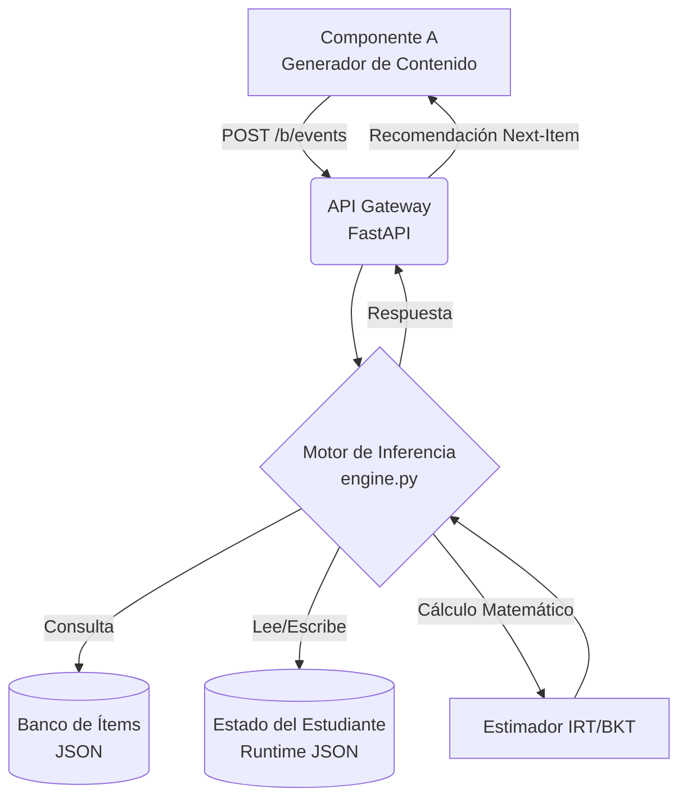

# Motor de Evaluación Adaptativa (Componente B)
### Sistema de Simulación de Clases Personalizadas con IA


Este repositorio aloja el **Componente B** del proyecto de titulación *"Simulador de Clases Personalizadas con IA Generativa"*. Es un motor de inferencia psicométrica diseñado para operar como un microservicio autónomo, encargado de estimar el nivel de conocimiento del estudiante y personalizar su ruta de aprendizaje en tiempo real.

---

## 🧠 1. Fundamentación Teórica

A diferencia de los exámenes tradicionales lineales, este motor implementa un enfoque híbrido probabilístico:

### A. Teoría de Respuesta al Ítem (IRT - Modelo 3PL)
Para la estimación global de la habilidad ($\theta$), utilizamos el Modelo de 3 Parámetros. La probabilidad de que un estudiante con habilidad $\theta$ acierte un ítem $i$ se calcula como:

$$P_i(\theta) = c_i + (1 - c_i) \frac{1}{1 + e^{-a_i(\theta - b_i)}}$$

Donde:
* **$a_i$ (Discriminación):** Qué tan bien el ítem separa a los estudiantes fuertes de los débiles.
* **$b_i$ (Dificultad):** El nivel de habilidad requerido para tener un 50% de probabilidad de acierto.
* **$c_i$ (Adivinanza):** La probabilidad de acertar por azar.

**Algoritmo de Estimación:** Utilizamos el método **EAP (Expected A Posteriori)** con integración numérica por cuadratura, lo que permite una convergencia más estable que el MLE en sesiones cortas.

### B. Bayesian Knowledge Tracing (BKT) + Decay Temporal
Para el diagnóstico granular de habilidades (ej. "Regla de la Cadena"), implementamos un modelo de Rastreo Bayesiano enriquecido con un factor de olvido:

$$P(L_t) = P(L_{t-1}) \cdot (1 - \text{Decay}(\Delta t))$$

Esto permite al sistema detectar cuándo un estudiante ha dejado de practicar y recomendar repasos automáticos ("Spaced Repetition").

---

## 🏗️ 2. Arquitectura del Sistema

El sistema sigue una arquitectura orientada a eventos y recursos (RESTful), priorizando la portabilidad mediante almacenamiento basado en archivos JSON (Document Store).



### Estructura de Directorios Clave
* `app/engine.py`: **Núcleo Lógico.** Contiene las clases `AdaptiveEngine` y `PsychometricModel`.
* `resources/data/item_bank.json`: **Base de Conocimiento.** Banco de preguntas calibradas.
* `runtime/`: **Persistencia.** Almacena el historial de sesiones y logs de auditoría (excluido de git por privacidad).
* `simulator.py`: **Validación.** Generador de agentes estocásticos para pruebas de Monte Carlo.

---

## 🔌 3. API Reference (Contratos)

El motor expone una API REST documentada automáticamente vía Swagger/OpenAPI.

### Endpoint Principal: Procesar Resultado
`POST /b/events`

Recibe el resultado de una interacción y devuelve la siguiente recomendación pedagógica.

**Ejemplo de Request (Entrada):**
```json
{
  "event_type": "activity_result",
  "student": { "student_id": "usr_123", "session_id": "sess_abc" },
  "context": { "topic_id": "t_derivadas", "mode": "practice" },
  "activity": { "item_id": "itm_005", "difficulty_label": "media" },
  "response": {
    "is_correct": true,
    "response_time_ms": 12500,
    "hint_used": false
  }
}
```

**Ejemplo de Response (Salida):**
```json
{
  "recommendation": {
    "action": "present_item",
    "item_id": "itm_042",
    "difficulty_target": "dificil",
    "reason": "max_info_gain"
  },
  "state": {
    "theta_hat": 0.85,
    "se_theta": 0.32,
    "mastery": { "k_regla_cadena": 0.92 }
  }
}
```

---

## 🛠️ 4. Instalación y Despliegue

### Requisitos
* Python 3.9+
* Pip

### Pasos
1.  **Clonar repositorio:**
    ```bash
    git clone [https://github.com/usuario/adaptive-engine-b.git](https://github.com/usuario/adaptive-engine-b.git)
    cd adaptive-engine-b
    ```
2.  **Configurar entorno virtual:**
    ```bash
    python -m venv venv
    # Linux/Mac
    source venv/bin/activate
    # Windows
    venv\Scripts\activate
    ```
3.  **Instalar dependencias:**
    ```bash
    pip install -r requirements.txt
    ```
4.  **Iniciar Servidor:**
    ```bash
    # Ejecutar como módulo para evitar errores de rutas
    python -m app.main
    ```
    El servidor estará disponible en: `http://localhost:8000`

---

## 🧪 5. Validación y Pruebas (Evidence)

Este componente ha superado pruebas rigurosas de funcionalidad y carga.

| Tipo de Prueba | Script | Descripción | Resultado |
| :--- | :--- | :--- | :--- |
| **Algorítmica** | `test_validation.py` | Verifica la convergencia de $\theta$ y reducción del error estándar. | **Error < 0.40** |
| **Cognitiva** | `test_longterm.py` | Simula el paso del tiempo (7 días) para validar la curva del olvido. | **Decay detectado (~18%)** |
| **Carga (Estrés)** | `stress_test.py` | Simula 50 usuarios concurrentes usando **Locust**. | **0% Fallos, 82ms latencia** |

### Cómo replicar las pruebas
```bash
# 1. Limpiar entorno previo (opcional)
# Windows: rmdir /s /q runtime
# Linux/Mac: rm -rf runtime/

# 2. Correr suite de validación matemática
python test_validation.py

# 3. Correr prueba de carga (requiere servidor activo)
locust -f stress_test.py
```

---

## 👥 Contribución y Autoría

**Desarrollado por:** Carlos Andrés Córdova Acaro
**Supervisado por:** Ph.D. Enrique Andrés Larco Ampudia
**Institución:** Escuela Politécnica Nacional (EPN)
**Año:** 2025

Este software es parte del proyecto de titulación y su uso está restringido a fines académicos y de investigación.